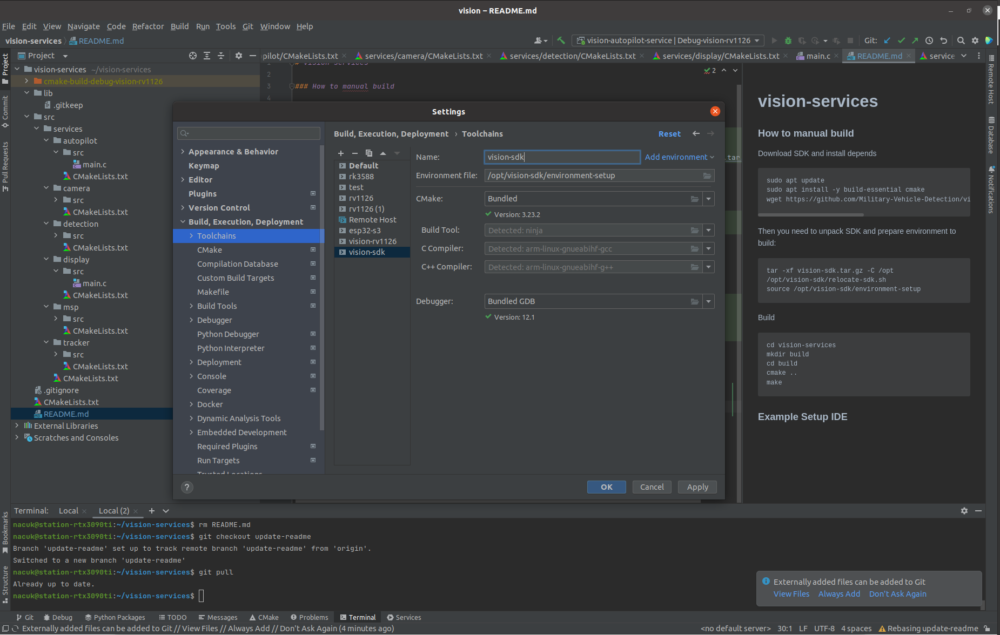

# Vision RV1126 helloworld app

### How to manually build

Download SDK and install depends  

Link for download SDK:
https://gitlab.hard-tech.org.ua/external/vision-rv1126-helloworld-app/uploads/ae99f5e0ad7f241999a00bcd6ba93606/vision-sdk.tar.gz

```sh
sudo apt update
sudo apt install -y build-essential cmake git
```

Then you need to unpack SDK and prepare environment to build:
```sh
tar -xf vision-sdk.tar.gz -C /opt
/opt/vision-sdk/relocate-sdk.sh
source /opt/vision-sdk/environment-setup
```

Build
```sh
git clone https://gitlab.hard-tech.org.ua/external/vision-rv1126-helloworld-app.git
cd vision-rv1126-helloworld-app
mkdir build
cd build
cmake ..
make
```

### How to deploy debug bin to board

There are two ways to download bin to the board `ssh` or `adb`

Connect the board to PC via USB Type-C

Hardware version 1.2


Debug Uart


Hardware version 1.4


Debug Uart


### Camera and MIPI CSI2 cable


### Stack with: Flight controller, Vision board, camera and heatsink


### Example install to drone


### Optional version with Gyro, Accelerometer, Barometer

Gyro & Acc


Barometer


1. SSH
```shell
# login: root
# pass: 123qwe
scp <path_to_bin> root@192.168.55.1:/tmp/
```

2. adb
```shell
adb push <path_to_bin> /tmp/
```

### How to connect to debug console
There are three ways to connect to debug console `ssh` or `adb` or `uart`

1. SSH
```shell
# connect board to PC via USB type-C
# login: root
# pass: 123qwe
ssh root@192.168.55.1
```

2. adb
```shell
adb shell
```

3. uart
```shell
# Need to solder uart debug wires 
sudo minicom -D /dev/ttyUSBx
```


### Example Setup IDE

#### Prepare toolchain

##### IntelliJ IDEA


##### Visual Studio Code
Reuired extension: [CMake Tools](https://marketplace.visualstudio.com/items?itemName=ms-vscode.cmake-tools)

Add this to `~/.local/share/CMakeTools/cmake-tools-kits.json` file
```
{
    "name": "Vision compiler",
    "toolchainFile": "/opt/vision-sdk/share/buildroot/toolchainfile.cmake",
    "isTrusted": true
}
```

#### Config Cmake
##### IntelliJ IDEA


##### Visual Studio Code
No additional configuration. Just select project and kit

#### Build & debug
##### IntelliJ IDEA
Prepare ssh for remote debug via GDB


Debug


##### Visual Studio Code
The `.vscode/launch.json` already contains the needed configuratuion for remote debug
Just select the project and target to launch and run debug. VSCode should compile binariy, upload it to target, start gdbserver and connect to it.